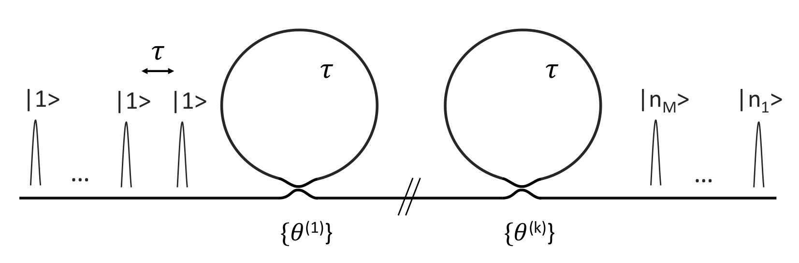
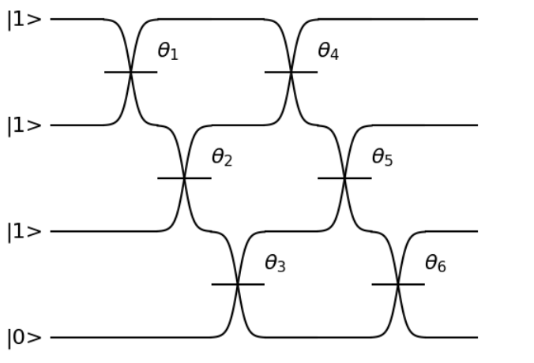

# PT Series Software Development Kit

## PT Series Overview

Welcome to ORCA Computing's python SDK for developing machine learning algorithms with the PT Series time bin
interferometer! ORCA's PT Series consists of a train of optical pulses that interfere with each other via programmable
beam splitters located within one or more fibre loops, as shown in the following illustration.



In this illustration, single photons separated by time $\tau$ interfere with each other in optical loops via beam
splitters with programmable reflectivities $\theta$, giving rise to a probability distribution over the output states
that is hard to simulate classically. The ability to efficiently sample from this hard probability distribution with
the PT Series can be harnessed by machine learning algorithms to solve problems in ways that classical algorithms would
find difficult.

## Software Overview

This repository contains the `ptseries` python module, which integrates either real or simulated PT Series with PyTorch
to allow users to easily develop and run hybrid machine learning workflows on quantum hardware. The `ptseries` module
contains three main sub-modules:

- `ptseries.tbi` contains both a programmatic interface to the quantum processor and state of the art simulators.
- `ptseries.models` contains PyTorch nn.Module extensions allowing users to handle the PT Series in the same way they
  would a PyTorch neural network layer.
- `ptseries.algorithms` contains implementations of hybrid quantum/classical algorithms.

This repository also includes tutorial notebooks that walk the user through the modules described above, and some
additional tools such as a logger in `ptseries.common`. A great place to start is the `getting_started` notebook in the
`tutorial_notebooks` folder.

## Conventions

In this toolkit, the user specifies the input state and the type of backend-end, which can be either a real or a
simulated PT Series processor. The number of programmable beam splitter coefficients depends on the number of input
modes and loops in the PT series. For instance, with N input modes and L loops, there are (N-1)\*L programmable beam
splitter coefficients. This convention is illustrated in the following figure with two loops and input state |1110>, in
a representation where each time bin is shown as a horizontal line and each programmable beam splitter is represented as
crossing lines.



In this diagram, for a |1110> input state and 2 loops, there are 6 trainable parameters and 4 output modes.

## Installation

### As a python module

Python version >=3.10 is required, as is PyTorch for automatic differentiation. This repository can be installed as a
python module by cloning this repository and running

```bash
pip install --upgrade pip
pip install .
```

from the root folder. This command installs the modules minimally required to run the core functions of this repository.

### As a Docker container

We also provide a Dockerfile, which can be used to build a Docker image by first cloning this repository and then
entering the following command from the root folder:

```bash
docker build -t ptseries .
```

You can then run the tests using:

```bash
docker run ptseries bash -c 'cd /root/code/ptseries-sdk && pytest'
```

or launch any one of the Jupyter notebooks in this repository, starting with:

```bash
docker run -p 8888:8888 -i ptseries bash -c "cd /root/code/ptseries-sdk && jupyter notebook --allow-root --no-browser --ip=0.0.0.0"
```

then opening the url that appears in the terminal and navigating to the desired notebook (see below for a description of the notebooks).

## Using this toolkit

### Simulating PT Series hardware

The following code produces one output sample from the PT Series illustrated above with a |1110> input state, 2 loops,
and 6 beam splitter angles set to $\pi/4$ (corresponding to 50:50 coupling coefficients):

```python
import numpy as np
from ptseries.tbi import create_tbi

input_state = (1,1,1,0)
beam_splitter_angles = [np.pi/4]*6
time_bin_interferometer = create_tbi(n_loops=2)

sample = time_bin_interferometer.sample(input_state, beam_splitter_angles)
```

### Using a real PT Series processor

The following code produces one output sample from a PT-1 containing a single loop and a |1000> input state. In this
example, we set the 3 beam splitter angles to $\pi/4$ (corresponding to 50:50 coupling coefficients):

```python
import numpy as np
from ptseries.tbi import create_tbi

input_state = (1,0,0,0)
beam_splitter_angles = [np.pi/4]*3
time_bin_interferometer = create_tbi(tbi_type="PT-1")

sample = time_bin_interferometer.sample(input_state, beam_splitter_angles)
```

## PyTorch integration

The PT Series can be used to implement a wide range of quantum variational algorithms, where a quantum device with
programmable parameters is trained by a classical optimisation loop to generate outputs that minimise a cost function.
Our `ptseries.models` module includes PyTorch nn.Module extensions allowing users to easily implement their own quantum
machine learning algorithms, and experiment with hybrid quantum/classical architectures. For instance, one could define
a hybrid quantum/classical neural network using a simulated PT Series as follows:

```python
import torch.nn as nn
from ptseries.models import PTLayer

input_state = (1,1,0,0)
input_dim = len(input_state)-1
output_dim = len(input_state)

model = nn.Sequential(
    nn.Linear(128, input_dim),
    PTLayer(input_state),
    nn.Linear(output_dim, 10)
    nn.LogSoftmax(dim=-1)
)
```

The PTLayer in this example is initialised with a single loop by default and acts as a quantum neural network layer with
3 inputs and 4 outputs. Another model for hybrid quantum/classical machine learning using the PT Series uses the PT
Series to generate probability distributions that can then be sent into a neural network. This method is implemented
within the PTGenerator class in this SDK. Further documentation and customisation options can be found in the README in
the `ptseries/models` folder.

## Example notebooks

Examples of how this toolkit can be used can be found as Jupyter notebooks in the `tutorial_notebooks` folder. Some
examples include:

- The `getting_started` notebook is the best place to start, and allows the user to simulate the PT Series to gain a
  better understanding of the system and the underlying physics
- The `ptseries_simulation` notebook allows the user to perform more complex simulations of a PT Series system.
- The `quantum_variational_classification` notebook provides an example of a hybrid quantum-classical neural network
  solving a simple classification task.

## Testing

The test suite can be run with the following commands:

```bash
pip install pytest
pytest
```
